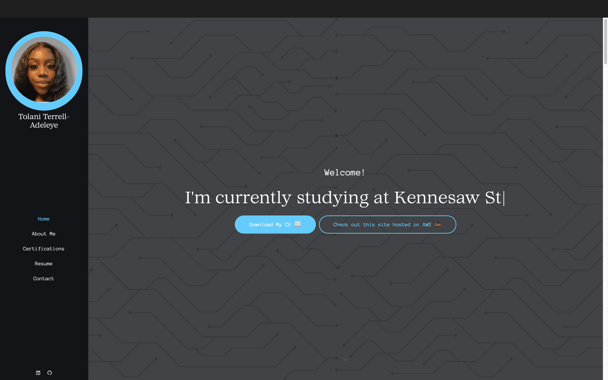

# Welcome to my virtual portfolio repository! 👋🏾

Hi, I'm **Tolani**, a solution-oriented cybersecurity student with an inclination to building my erudition and discovering as much of the world as I can. With a passion for technology and information security, I strive to apply these predilections to the field to not only meet but exceed expectations and drive meaningful results in my field. 

Utilizing HTML, CSS, and JavaScript, in PyCharm and GitHub, I designed my own virtual portfolio to display my professional background.

Visit the site hosted on GitHub pages [here](https://tmadeline.github.io/) and on AWS [here](https://tolani.cloud/). 
*Feel free to connect with me via the contact details located in my portfolio, or scroll down to the contact section and schedule a quick meeting to get to know me!*

